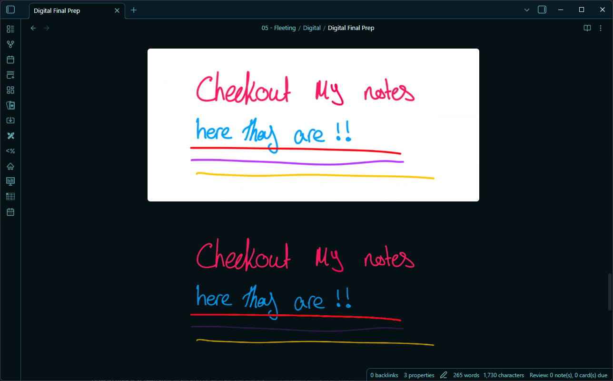
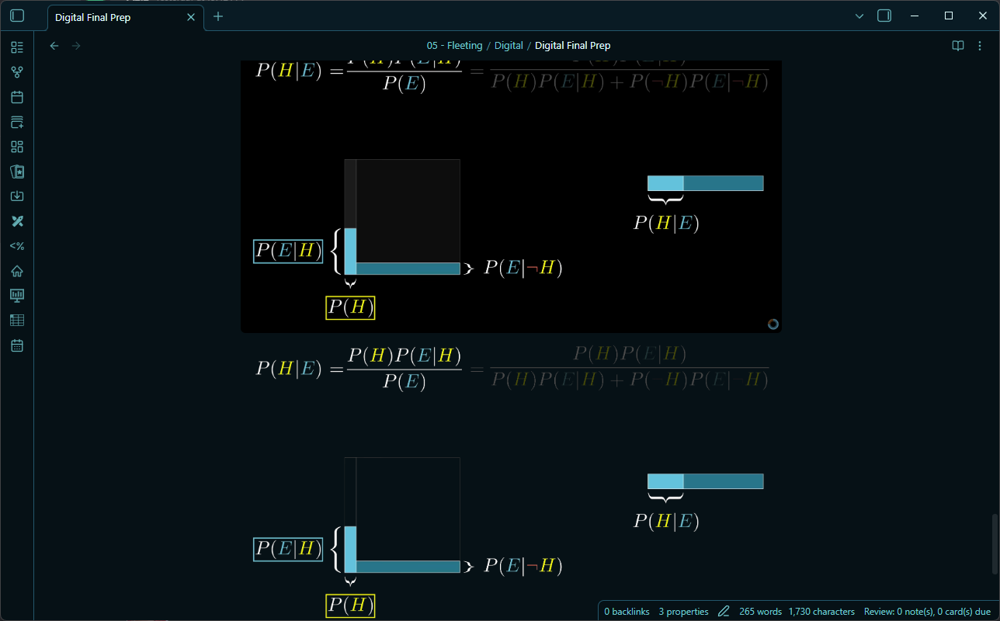
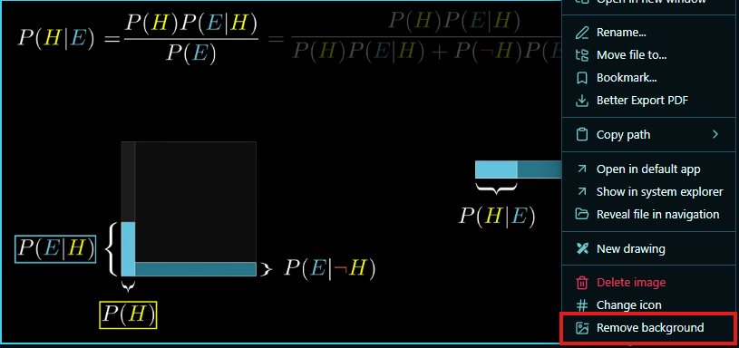
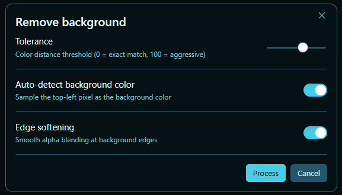

# Chroma Key Paste
Easily remove the background from your pasted images directly within Obsidian.
Perfect for screenshots, diagrams, and making your notes look clean, seamless, and professional.

- remove backgrounds from images with a single click
- seamlessly integrated into the right-click context menu
- fine-tune with adjustable tolerance and edge softening
- automatically detects the background color (or pick your own!)
- keeps your vault clean by saving processed images to a dedicated folder

**Before & After Example**

## Remove Backgrounds on Demand!

- **Paste** your image into Obsidian as usual.
- **Right Click** the image link in your note and select "Remove background".

## Fine-tune your cutouts: The Processing Modal

  

- Adjust the **Tolerance** slider to control how aggressively the color is removed.
- Use **Edge softening** to create smooth alpha blending for cleaner results.
- **Auto-detect** the background color from the top-left pixel, or specify an exact Hex code.

---

### Removing a Background
- Paste an image into your note normally.
- Right-click the image embed (e.g., `![[Pasted image.png]]`) and select "Remove background".
- Adjust the settings in the popup modal to your liking.
- Click **Process** — the background is removed, saved as a new transparent PNG, and the link in your editor is automatically updated!
- *Alternative:* Use the Command Palette and search for "Remove background from image" while your cursor is on an image link.

### Customizing the Defaults
- Go to **Settings → Chroma Key Paste** to configure the default settings for the processing modal:
  - **Auto-detect background color**: On/Off
  - **Target color**: The hex color to remove (e.g., `#ffffff`)
  - **Default tolerance**: 0 (exact match) to 100 (very aggressive)
  - **Edge softening**: On/Off

### Organizing Processed Images
- The plugin automatically saves your new transparent images into a `chroma/` folder to keep your vault tidy.
- **Want to rename or move the folder?** Go ahead! The plugin automatically tracks the folder if you rename or move it anywhere inside your vault.

---

## Contributing

Contributions are always welcome! If you'd like to help improve Chroma Key Paste:
1. Fork the repository
2. Clone your fork locally (`git clone https://github.com/YOUR_USERNAME/obsidian-chroma-key.git`)
3. Run `npm install` to install dependencies
4. Run `npm run dev` to start the build in watch mode
5. Make your changes and test them in Obsidian
6. Commit your changes and open a Pull Request!

---

## Feedback & Support

If this plugin saves you time and makes your notes look better, I'd really appreciate a star on GitHub! It helps others find the plugin and keeps me motivated to improve it.

Got a bug or a feature request? Feel free to [open an issue](https://github.com/Aziz-Zahran/obsidian-chroma-key/issues) on the repository.
